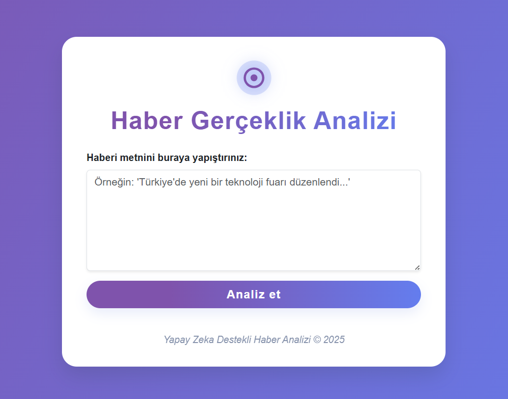

# Haber Gerçeklik Analizi (FastAPI)

Bir haberin gerçek mi, sahte mi olduğunu hızlıca analiz edebileceğiniz Python FastAPI tabanlı web uygulaması.

## Özellikler
- Modern, responsive arayüz
- Metin ön işleme
- Değişken mühendisliği
- NLP teknikleri
- Makine öğrenmesi modelleri
- FastAPI tabanlı backend
- Gerçek/Sahte haber tespiti
- REST API (Swagger ile test edilebilir)

## Canlı Demo
- https://fake-true-news.onrender.com adresinden uygulamamı deneyebilirsiniz

## Kullanım
- Ana sayfada haberinizi girin, sonucu görün!
- API dokümanları için `/docs` adresini ziyaret edin.

## Uygulama Ekran Görüntüsü

